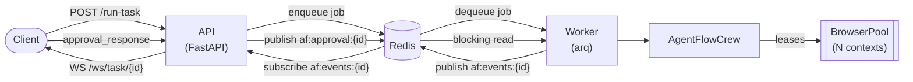
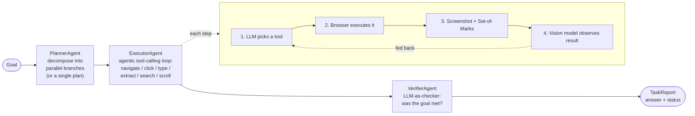

# AgentFlow

**An autonomous, vision-grounded web-browsing agent.** Give it a goal in plain
English — *"find and compare a product across two shopping sites"* — and a
crew of LLM agents plans the task, drives a real Chromium browser step by step,
*looks* at each screenshot to decide what to do next, and returns a verified
answer. The whole run streams live to a React dashboard.

AgentFlow is built around a **multi-agent loop** (Planner → Executor → Verifier),
**multimodal grounding** (a vision model reads every page), and a
**production-minded backend** (provider fallback across 5 LLM vendors, a
job queue, a pre-warmed browser pool, human-in-the-loop approvals, cost/token
observability, and a WebVoyager-style eval harness).

---

## Table of Contents

- [AgentFlow](#agentflow)
  - [Table of Contents](#table-of-contents)
  - [Why it's interesting](#why-its-interesting)
  - [Architecture](#architecture)
    - [The agent crew](#the-agent-crew)
  - [How a task flows through the system](#how-a-task-flows-through-the-system)
  - [Key features](#key-features)
    - [Multi-agent orchestration](#multi-agent-orchestration)
    - [Vision-grounded perception + Set-of-Marks](#vision-grounded-perception--set-of-marks)
    - [Parallel branch execution](#parallel-branch-execution)
    - [5-provider LLM fallback (LiteLLM)](#5-provider-llm-fallback-litellm)
    - [Human-in-the-loop approvals](#human-in-the-loop-approvals)
    - [Browser pool + job queue](#browser-pool--job-queue)
    - [Cost \& token observability](#cost--token-observability)
    - [Resilience](#resilience)
    - [Windows-safe Playwright](#windows-safe-playwright)
    - [WebVoyager-style eval harness](#webvoyager-style-eval-harness)
    - [Live React dashboard](#live-react-dashboard)
  - [Tech stack](#tech-stack)
  - [Configuration](#configuration)
  - [API reference](#api-reference)
  - [Evaluation harness](#evaluation-harness)
  - [Observability](#observability)
  - [Project layout](#project-layout)

---

## Why it's interesting

This isn't a thin wrapper around an LLM API. The hard parts of building a real
agent are all here:

| Problem | How AgentFlow solves it |
|---------|-------------------------|
| **Grounding** — how does the model know *where* to click? | **Set-of-Marks** visual prompting: every page is annotated with numbered boxes over clickable elements; the model picks a *number* instead of hallucinating a CSS selector. |
| **Perception** — how does it know an action worked? | After each step a **vision model** (Gemini 2.5 Flash) inspects the screenshot and reports success/failure + extracted data — the visual check can override a "successful" click. |
| **Reliability** — free LLM tiers rate-limit constantly | A **5-provider fallback chain** (LiteLLM) transparently fails over on any 429/quota error, so one exhausted quota never sinks a task. |
| **Recovery** — steps fail | A **re-planner** generates a fresh recovery plan from what already succeeded, then retries. |
| **Speed** — independent sub-goals | The planner **decomposes** splittable goals ("compare A vs B") into **parallel branches**, each on its own browser. |
| **Safety** — destructive actions | A **human-in-the-loop approval gate** pauses on risky actions (delete / purchase / confirm / send) and waits for a click. |
| **Cost** — vision calls are expensive | An **LRU observation cache** keyed on screenshot+context hashes skips redundant vision calls; **token-budget trimming** shrinks the conversation each step. |
| **Scale** — one browser per task is wasteful | A **job queue (arq/Redis)** + **pre-warmed browser pool** lend isolated Chromium contexts to bounded-concurrency workers. |

---

## Architecture

AgentFlow runs in two interchangeable modes behind the **same external API**,
selected by the `USE_QUEUE` flag:

- **In-process** (`USE_QUEUE=0`) — the API process runs the crew in a background
  task and streams over an in-memory socket map. No Redis. Simplest for local dev.
- **Queued** (`USE_QUEUE=1`, default) — the API enqueues onto **arq**; a separate
  **worker** runs the crew against a pre-warmed **BrowserPool** and fans progress
  back over **Redis pub/sub**. Horizontally scalable (`--scale worker=N`).



### The agent crew



- **PlannerAgent** ([backend/agents/planner.py](backend/agents/planner.py)) —
  turns a goal into a step plan, and decides whether it splits into independent
  **parallel branches**. Also handles **re-planning** after a failure.
- **ExecutorAgent** ([backend/agents/executor.py](backend/agents/executor.py)) —
  the heart of the system. Runs the agentic tool-calling loop, drives the
  browser, takes annotated screenshots, calls the vision model, manages the
  token budget, and gates risky actions on human approval.
- **VerifierAgent** ([backend/agents/verifier.py](backend/agents/verifier.py)) —
  an LLM-as-judge that reviews the executed steps + extracted data and writes the
  final answer and a `completed / partial / failed` status.
- **AgentFlowCrew** ([backend/crew.py](backend/crew.py)) — orchestrates the three
  agents, runs branches in parallel, merges results, attaches metrics, and
  persists the report.

---

## How a task flows through the system

1. **`POST /run-task`** with `{"goal": "..."}` → returns a `task_id`.
2. The client opens **`WS /ws/task/{task_id}`** and starts receiving events:
   `planned` → `step_done` (×N) → `replanned`? → `metrics` → `completed`.
3. The **Planner** decomposes the goal (parallel branches if independent).
4. The **Executor** runs each branch's agentic loop. Every step:
   - the reasoning LLM picks a tool via **function calling**,
   - the browser performs it,
   - a screenshot is taken and annotated with **Set-of-Marks** numbers,
   - the **vision model** observes the result and extracts data,
   - the observation is fed back for the next decision.
5. On a risky action, the Executor emits **`approval_required`** and blocks until
   the UI sends an approval/denial back over the socket.
6. On a dead-end failure, the **Planner re-plans** once and the Executor retries.
7. The **Verifier** judges the merged results and writes the final answer.
8. The **TaskReport** (plan + per-step results + screenshots + metrics) is saved
   to SQLite and emitted as `completed`. It can be replayed via `GET /replay/{id}`.

---

## Key features

### Multi-agent orchestration

Planner / Executor / Verifier with explicit re-planning on failure — not a single
monolithic prompt.

### Vision-grounded perception + Set-of-Marks

Every page is screenshotted and overlaid with numbered boxes on interactable
elements. The model calls `click_mark(7)` instead of guessing
`button.add-to-cart`, and a vision model validates the outcome of every action.
JPEG screenshots (q80) keep marks legible while cutting VLM latency.

### Parallel branch execution

Goals like *"get the weather in Paris, Tokyo and NYC"* are decomposed into
independent branches that run concurrently, each on its own browser, then merged
— with per-branch step numbering so screenshots and events never collide.

### 5-provider LLM fallback (LiteLLM)

Reasoning and vision each have an ordered model chain spanning Groq, OpenRouter,
Cerebras, GitHub Models, and Gemini. A 429 or quota exhaustion on one provider
transparently fails over to the next. Chains are fully env-overridable.

### Human-in-the-loop approvals

Risky tool calls (matching `delete / purchase / confirm / send`) pause the run
and surface an approval banner in the UI; the worker blocks (with a timeout) for
the human decision — bridged across processes over Redis in queue mode.

### Browser pool + job queue

arq workers lease pre-warmed Chromium **contexts** (isolated sessions sharing one
browser process) from a `BrowserPool`. Concurrency is bounded twice over (arq
`max_jobs` **and** pool size) so the system never runs more tasks than it has
warmed contexts.

### Cost & token observability

Every LLM call's tokens, USD cost, latency, and serving provider are recorded
per-task and globally. A vision **LRU cache** records the calls (and dollars) it
saved. Exposed at `GET /metrics` and `GET /health`. Zero-overhead when disabled.

### Resilience

The navigation layer is wrapped in a **retry policy + circuit breaker** (bounded
exponential backoff with jitter; the breaker fails fast on a wedged site).
LLM retries deliberately live only in LiteLLM to avoid double-retrying.

### Windows-safe Playwright

All Playwright calls are dispatched onto a dedicated **ProactorEventLoop thread**,
so browser subprocess launch works even under uvicorn/arq's Selector loops.

### WebVoyager-style eval harness

~50 real web tasks across Wikipedia, Allrecipes, GitHub, arXiv, and Google Maps,
scored by an **LLM-as-judge** on an independently configurable model chain, with
a Markdown report. Includes a keyless/networkless mock mode for CI.

### Live React dashboard

A dark, operator-style two-panel UI streams the plan, each step (with screenshot
crossfades and expandable rows), the approval banner, a metrics panel, and the
final answer over WebSocket — with reconnection on refresh and task history.

---

## Tech stack

| Layer | Technology |
|-------|-----------|
| **Backend** | Python 3.11+, FastAPI, WebSockets, Pydantic |
| **Browser automation** | Playwright (Chromium), Set-of-Marks visual grounding |
| **LLM layer** | LiteLLM (Groq · Gemini · OpenRouter · Cerebras · GitHub Models) |
| **Reasoning model** | Llama 3.3 70B (function calling) + fallbacks |
| **Vision model** | Gemini 2.5 Flash + fallbacks |
| **Queue / scaling** | arq + Redis (job queue + pub/sub event bus) |
| **Persistence** | SQLite (SQLAlchemy + aiosqlite) |
| **Frontend** | React 19, Vite, Tailwind CSS v4 |
| **Infra** | Docker + docker-compose, structured JSON logging |
| **Testing / eval** | pytest, custom WebVoyager-style harness with LLM-as-judge |

---

## Configuration

Everything is env-driven (see [.env.example](.env.example) for the full list).
Highlights:

| Variable | Default | Meaning |
|----------|---------|---------|
| `GROQ_API_KEY`, `GEMINI_API_KEY`, … | — | Provider keys (LiteLLM reads them by name) |
| `REASONING_MODELS` / `VISION_MODELS` | built-in chains | Comma-separated fallback chains, primary first |
| `USE_QUEUE` | `1` | Queue mode (Redis) vs in-process |
| `REDIS_URL` | `redis://localhost:6379` | Queue + event bus |
| `BROWSER_POOL_SIZE` | `2` | Pre-warmed Chromium contexts per worker |
| `WORKER_CONCURRENCY` | = pool size | Max in-flight jobs |
| `BROWSER_HEADLESS` | `0` | `1` in containers (no display) |
| `SOM_ENABLED` | `1` | Set-of-Marks grounding (vs raw selectors) |
| `PARALLEL_ENABLED` / `MAX_PARALLEL_BRANCHES` | `1` / `3` | Parallel branch fan-out |
| `EXECUTOR_MAX_STEPS` | `15` | Hard step cap per branch |
| `HISTORY_WINDOW` | `6` | Recent tool exchanges kept in context |
| `APPROVAL_TIMEOUT_S` | `300` | How long an approval blocks before auto-denying |
| `METRICS_ENABLED` | `1` | Token/cost/latency accounting |

---

## API reference

| Method | Endpoint | Purpose |
|--------|----------|---------|
| `POST` | `/run-task` | Start a task. Body `{ "goal": "...", "task_id"?: "..." }` → `{ task_id, status }` |
| `WS` | `/ws/task/{task_id}` | Live event stream; send `{type:"approval_response", approved}` or `{type:"stop"}` |
| `GET` | `/tasks?limit=N` | Recent task history |
| `GET` | `/replay/{task_id}` | Full saved `TaskReport` for replay |
| `GET` | `/health` | Liveness + mode, pool size, Redis reachability, cost/token totals |
| `GET` | `/metrics?task_id=` | Global or per-task token/cost/latency + vision-cache metrics |
| `GET` | `/screenshots/...` | Captured page images |

**WebSocket events:** `planned`, `step_done`, `replanned`, `approval_required`,
`metrics`, `completed`, `stopped`, `error`.

---

## Evaluation harness

A WebVoyager-style harness runs the crew over a dataset and scores each task with
an LLM-as-judge. See [eval/README.md](eval/README.md) for details.

```bash
make eval            # full dataset (live) → eval/results/REPORT.md
make eval-smoke      # 3-task CI smoke subset
make eval-mock       # harness self-test: no keys, no browser, no network
```

The judge runs on its own `JUDGE_MODELS` chain (default = reasoning chain) so you
can score with a stronger/neutral model than the one under test.

---

## Observability

Every task records token usage, USD cost, latency, the serving provider, and
vision-cache effectiveness — *without* affecting tool selection or model outputs
(metrics are read only after a call returns). See
[backend/METRICS.md](backend/METRICS.md) and
[backend/SCALING.md](backend/SCALING.md) for the full write-ups.

```bash
curl localhost:8000/metrics                 # global aggregate
curl localhost:8000/metrics?task_id=abc123  # one task
curl localhost:8000/health                  # mode + cost/token totals + Redis status
```

---

## Project layout

```
agentflow/
├── backend/
│   ├── main.py            FastAPI app: REST + WebSocket, in-process & queue transports
│   ├── crew.py            AgentFlowCrew: orchestrates planner/executor/verifier, parallel branches
│   ├── agents/
│   │   ├── planner.py     Plan, decompose into parallel branches, re-plan on failure
│   │   ├── executor.py    Agentic tool-calling loop, Set-of-Marks, vision, approvals, token budget
│   │   └── verifier.py    LLM-as-judge: final answer + status
│   ├── llm.py             LiteLLM layer: 5-provider reasoning + vision fallback chains
│   ├── browser.py         Playwright wrapper: stealth, Set-of-Marks annotation, Windows Proactor loop
│   ├── pool.py            BrowserPool: pre-warmed Chromium contexts lent to workers
│   ├── worker.py          arq worker: consumes jobs, leases browsers, fans events to Redis
│   ├── events.py          Redis pub/sub event bus (progress + approvals across processes)
│   ├── resilience.py      Retry policy + circuit breaker for the navigation layer
│   ├── metrics.py         Token/cost/latency/cache accounting
│   ├── config.py          Centralized env-driven settings
│   ├── schemas.py         Pydantic models: TaskPlan, StepResult, TaskReport, TaskMetrics, …
│   └── db.py              SQLite persistence (SQLAlchemy + aiosqlite)
├── frontend/              React 19 + Vite + Tailwind v4 operator-style dashboard
│   └── src/components/    TopBar, TaskPanel, ApprovalBanner, MetricsPanel, ActivityFeed, …
├── eval/                  WebVoyager-style eval harness + LLM-as-judge + dataset
├── tests/                 pytest suite
├── docker-compose.yml     Redis + API + worker
├── Dockerfile
└── .env.example
```

---
